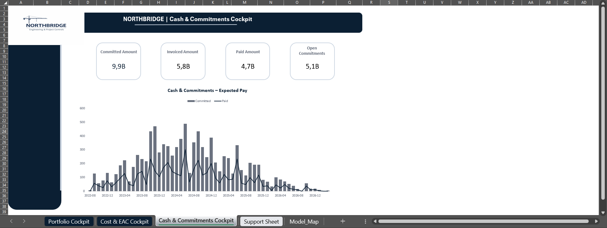
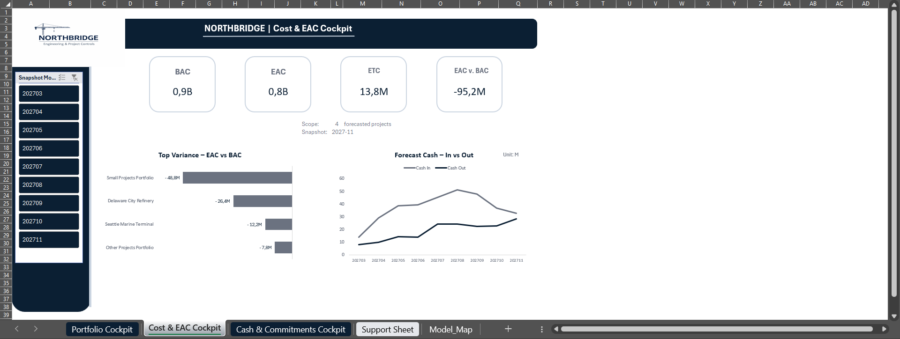
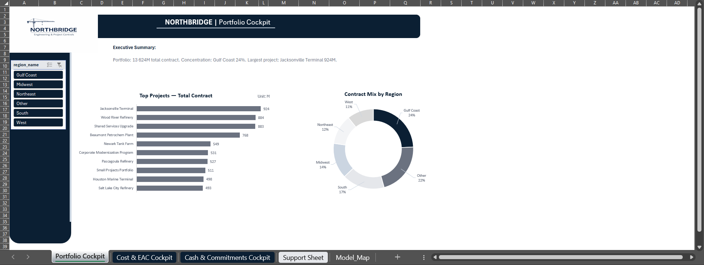

# 📊 Financial Controlling Dashboard (Excel + Power Pivot)

Excel-based financial controlling model with Power Pivot for EPC/construction project portfolio management. Features EAC/ETC variance analysis, WIP tracking, cash forecasting, and commitment management.

---

## 🎯 Project Overview

**Business Context:** Financial controlling for a fictional EPC contractor (Northbridge Engineering & Construction Ltd.) managing a portfolio of 66 industrial projects across USA regions.

**Objective:** Build a comprehensive controlling model that mirrors real-world CFO/Controller reporting needs:
- Portfolio performance monitoring
- Cost variance and EAC analysis
- Cash flow and commitment tracking

**Key Metrics Tracked:**
- 📈 **BAC** (Budget at Completion): $916M
- 📉 **EAC** (Estimate at Completion): $821M  
- 💰 **ETC** (Estimate to Complete): $13.8M
- ⚠️ **EAC vs BAC Variance**: -$95.2M
- 💵 **Total Commitments**: $9.9B
- 🏦 **Open Commitments**: $5.1B

---

## 📸 Dashboard Screenshots

### Portfolio Cockpit
Executive overview with Top Projects ranking and regional distribution.



### Cost & EAC Cockpit
Variance analysis (EAC vs BAC), cash forecast with snapshot selection.



### Cash & Commitments Cockpit
Commitment lifecycle tracking: Committed → Invoiced → Paid amounts.



---

## 🗂️ Data Model (Star Schema)

The model uses a **star schema** architecture optimized for Power Pivot analysis:
```
                    ┌─────────────────┐
                    │   dim_company   │
                    │   (1 row)       │
                    └────────┬────────┘
                             │
┌─────────────┐    ┌─────────┴─────────┐    ┌─────────────┐
│ dim_client  │    │                   │    │ dim_region  │
│ (9 rows)    │───▶│ fact_project_month│◀───│ (7 rows)    │
└─────────────┘    │   (1,344 rows)    │    └─────────────┘
                   │                   │
┌─────────────┐    └─────────┬─────────┘    ┌─────────────────┐
│dim_date_month│◀────────────┤              │fact_project_    │
│ (65 rows)   │              │              │contract (66)    │
└─────────────┘    ┌─────────┴─────────┐    └─────────────────┘
                   │   dim_project     │
┌─────────────┐    │   (66 rows)       │    ┌─────────────────┐
│ dim_vendor  │    └───────────────────┘    │fact_baseline_   │
│ (14 rows)   │                             │month (1,344)    │
└──────┬──────┘                             └─────────────────┘
       │
       ▼           ┌───────────────────┐    ┌─────────────────┐
┌──────────────┐   │fact_forecast_     │    │fact_resource_   │
│fact_         │   │snapshot (156)     │    │plan_month(1,344)│
│commitments   │   └───────────────────┘    └─────────────────┘
│(793 rows)    │
└──────────────┘
```

### Dimension Tables
| Table | Rows | Description |
|-------|------|-------------|
| `dim_company` | 1 | Company master (Northbridge Engineering) |
| `dim_client` | 9 | Client/customer master |
| `dim_region` | 7 | USA regions (Gulf Coast, West, South, etc.) |
| `dim_project` | 66 | Project master with contract details |
| `dim_vendor` | 14 | Vendor/subcontractor master |
| `dim_date_month` | 65 | Calendar dimension (2022-2027) |

### Fact Tables
| Table | Rows | Grain | Description |
|-------|------|-------|-------------|
| `fact_project_month` | 1,344 | Project × Month | Main fact: earned, invoiced, cash, costs, WIP |
| `fact_project_contract` | 66 | Project | Contract values, budget, planned margin |
| `fact_baseline_month` | 1,344 | Project × Month | Planned progress and value |
| `fact_commitments` | 793 | PO Line | Purchase orders and payment tracking |
| `fact_forecast_snapshot` | 156 | Snapshot × Month × Project | Rolling EAC/cash forecasts |
| `fact_resource_plan_month` | 1,344 | Project × Month | Labor hours and cost planning |

---

## 📐 Key Measures (DAX / Excel Formulas)

### Cost Performance
```
BAC = SUM(fact_project_contract[budget_total_cost_pln])
EAC = SUM(fact_forecast_snapshot[forecast_eac_cost])
ETC = [EAC] - [Actual Cost To Date]
EAC vs BAC = [EAC] - [BAC]
```

### Revenue & Margin
```
Earned Revenue = SUM(fact_project_month[earned_revenue_pln])
Invoiced Revenue = SUM(fact_project_month[invoiced_revenue_pln])
Cash Received = SUM(fact_project_month[cash_received_pln])
WIP = [Earned Revenue] - [Invoiced Revenue]
```

### Commitments
```
Committed Amount = SUM(fact_commitments[committed_amount])
Invoiced Amount = SUM(fact_commitments[invoiced_amount])
Paid Amount = SUM(fact_commitments[paid_amount])
Open Commitments = [Committed Amount] - [Paid Amount]
```

---

## 🛠️ Technical Stack

| Component | Technology |
|-----------|------------|
| Data Model | Star Schema (6 dimensions + 6 facts) |
| ETL | Power Query (folder import) |
| Analysis | Power Pivot (Data Model) |
| Visualization | Excel PivotCharts + Slicers |
| Dashboards | 3 Cockpits (Portfolio, Cost/EAC, Cash) |

---

## 📁 Repository Structure
```
Financial-Controlling-Dashboard-Excel/
├── README.md
├── Controlling_TrainingModel.xlsx      # Main Excel model
├── data/
│   ├── dim_client.csv
│   ├── dim_company.csv
│   ├── dim_date_month.csv
│   ├── dim_project.csv
│   ├── dim_region.csv
│   ├── dim_vendor.csv
│   ├── fact_baseline_month.csv
│   ├── fact_commitments.csv
│   ├── fact_forecast_snapshot.csv
│   ├── fact_project_contract.csv
│   ├── fact_project_month.csv
│   └── fact_resource_plan_month.csv
└── screenshots/
    └── (dashboard screenshots)
```

---

## 🚀 How to Use

1. **Download** or clone this repository
2. **Place CSV files** in a local folder (e.g., `C:\Data\Controlling\`)
3. **Open** `Controlling_TrainingModel.xlsx`
4. **Update Power Query source**:
   - Go to `Data` → `Queries & Connections`
   - Edit the folder path to your local CSV location
   - Click `Refresh All`
5. **Explore dashboards** using the sheet tabs at the bottom

### Requirements
- Microsoft Excel 2016+ (with Power Pivot enabled)
- Windows OS (for full Power Pivot functionality)

---

## 📚 Learning Objectives

This project demonstrates skills in:
- ✅ Star schema data modeling
- ✅ Power Query ETL (folder import, transformations)
- ✅ Power Pivot relationships and DAX measures
- ✅ Financial controlling KPIs (EAC, ETC, WIP, DSO)
- ✅ Executive dashboard design with slicers
- ✅ Variance analysis and forecasting

---

## 👤 Author

Portfolio project for Financial Controller / Data Analyst role.

---

## 📄 License

This project uses synthetic data for educational purposes only.
